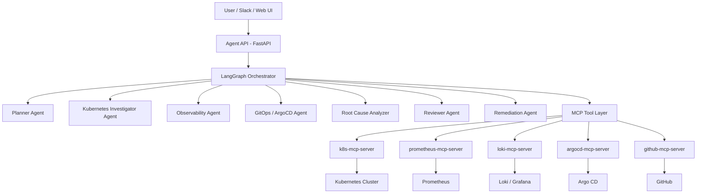
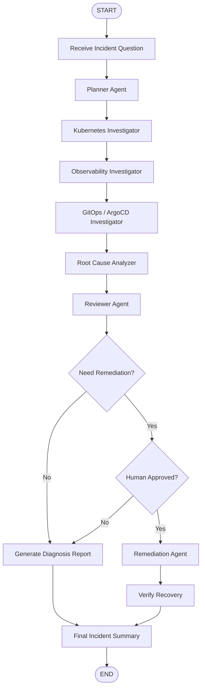
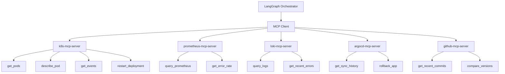
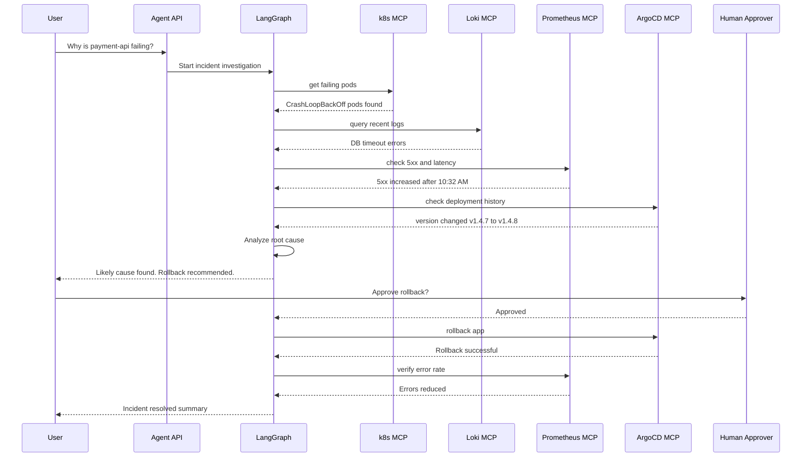
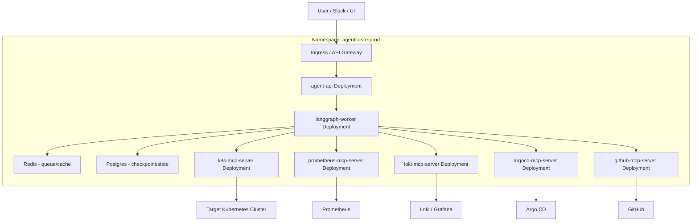
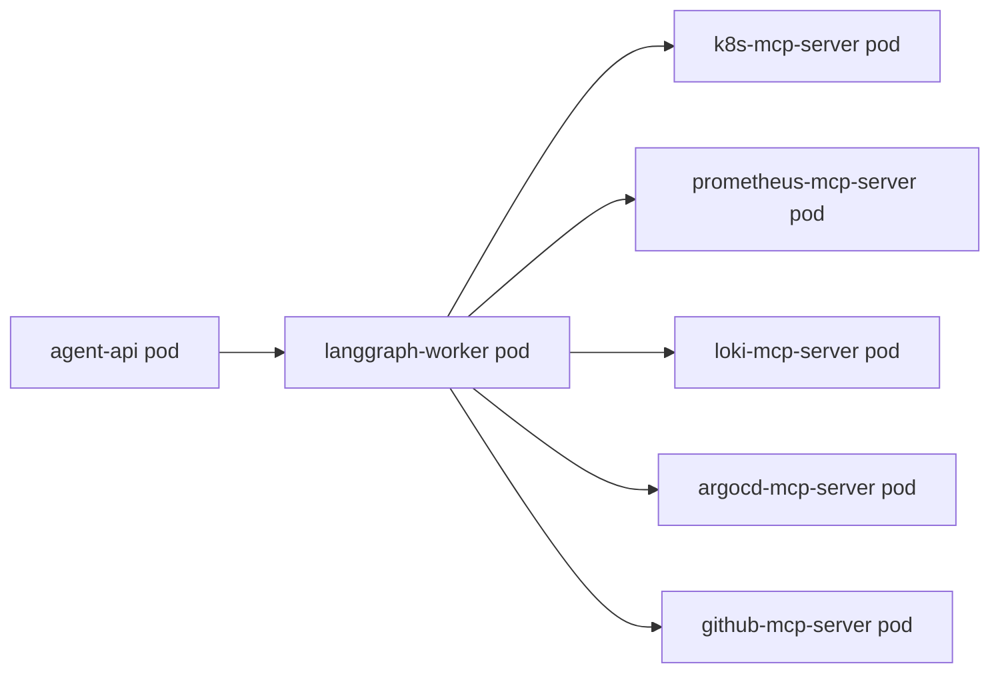
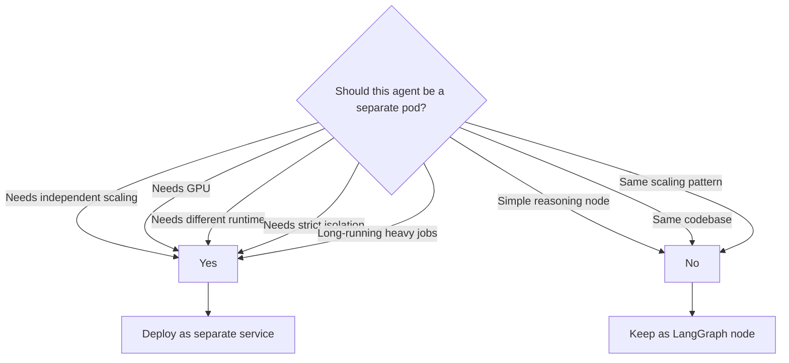
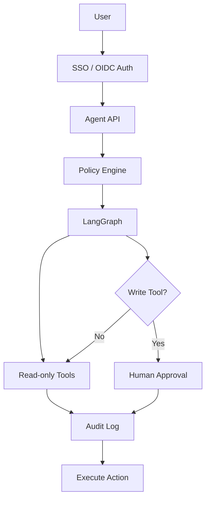
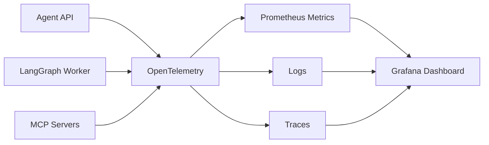

# Production Agentic System Architecture
## Use Case: Kubernetes SRE Agent using LangGraph + MCP + Kubernetes

---

## 1. Production Use Case

### Scenario

A user asks:

> Why is `payment-api` failing in production?

The agentic system investigates Kubernetes, logs, metrics, traces, GitOps history, and cloud infrastructure. It then produces a root cause analysis and optionally performs a safe remediation after human approval.

---

## 2. Big Picture Architecture



### Explanation

| Layer | Responsibility |
|---|---|
| User Interface | Slack, Teams, Web UI, CLI |
| Agent API | Receives user request |
| LangGraph | Controls workflow and agent routing |
| Agents | Planner, investigator, reviewer, remediation |
| MCP Servers | Provide standard tool access |
| External Systems | Kubernetes, Prometheus, Loki, ArgoCD, GitHub |

---

## 3. Simple Explanation for Students

```text
LangGraph = Brain / Workflow engine
MCP       = Tool connection standard
Kubernetes = Runtime platform
```

### Example

```text
User asks: Why is payment-api failing?

LangGraph decides the steps.
MCP tools collect real data.
Kubernetes runs the agentic system.
```

---

## 4. LangGraph Agent Workflow



---

## 5. Agent Responsibilities

```mermaid
flowchart LR
    P[Planner Agent] -->|Creates investigation plan| K[Kubernetes Agent]
    K -->|Pod status, events, deployment| O[Observability Agent]
    O -->|Logs, metrics, traces| G[GitOps Agent]
    G -->|Deployment history, commits| R[Root Cause Agent]
    R -->|Finds likely cause| V[Reviewer Agent]
    V -->|Approves safe response| M[Remediation Agent]
```



### Agents

| Agent | Purpose |
|---|---|
| Planner Agent | Breaks problem into steps |
| Kubernetes Agent | Checks pods, events, deployments, nodes |
| Observability Agent | Checks logs, metrics, traces |
| GitOps Agent | Checks ArgoCD sync and Git commits |
| Root Cause Agent | Combines evidence and identifies issue |
| Reviewer Agent | Validates recommendation |
| Remediation Agent | Executes approved action |

---

## 6. MCP Tool Architecture



---

## 7. Example Investigation Flow



---

## 8. Kubernetes Deployment Architecture



---

## 9. Production Pod Design

### Recommended production model



### Important point

Do **not** create one pod per logical agent initially.

Better design:

```text
Planner Agent
Kubernetes Agent
Observability Agent
Reviewer Agent
Remediation Agent
```

These are usually **logical nodes inside LangGraph**, not separate Kubernetes pods.

Separate pods are mainly for:

- MCP tool servers
- API service
- background workers
- databases
- queues

---

## 10. When to Separate Agents into Different Pods



---

## 11. Example Kubernetes Components

```text
Namespace:
  agentic-sre-prod

Deployments:
  agent-api
  langgraph-worker
  k8s-mcp-server
  prometheus-mcp-server
  loki-mcp-server
  argocd-mcp-server
  github-mcp-server

State:
  postgres
  redis

Security:
  service-account-agent
  service-account-k8s-mcp
  network-policies
  secrets
  configmaps
```

---

## 12. Example Kubernetes YAML Skeleton

```yaml
apiVersion: apps/v1
kind: Deployment
metadata:
  name: langgraph-worker
  namespace: agentic-sre-prod
spec:
  replicas: 2
  selector:
    matchLabels:
      app: langgraph-worker
  template:
    metadata:
      labels:
        app: langgraph-worker
    spec:
      containers:
        - name: worker
          image: company/agentic-sre-worker:1.0.0
          env:
            - name: REDIS_URL
              value: redis://redis:6379
            - name: POSTGRES_URL
              valueFrom:
                secretKeyRef:
                  name: agent-secrets
                  key: postgres-url
            - name: K8S_MCP_URL
              value: http://k8s-mcp-server:8080
            - name: PROMETHEUS_MCP_URL
              value: http://prometheus-mcp-server:8080
```

---

## 13. MCP Server Deployment Example

```yaml
apiVersion: apps/v1
kind: Deployment
metadata:
  name: k8s-mcp-server
  namespace: agentic-sre-prod
spec:
  replicas: 2
  selector:
    matchLabels:
      app: k8s-mcp-server
  template:
    metadata:
      labels:
        app: k8s-mcp-server
    spec:
      serviceAccountName: k8s-mcp-reader
      containers:
        - name: k8s-mcp-server
          image: company/k8s-mcp-server:1.0.0
          ports:
            - containerPort: 8080
```

---

## 14. Service Example

```yaml
apiVersion: v1
kind: Service
metadata:
  name: k8s-mcp-server
  namespace: agentic-sre-prod
spec:
  selector:
    app: k8s-mcp-server
  ports:
    - port: 8080
      targetPort: 8080
```

---

## 15. Security Architecture



### Security rules

```text
1. Read-only tools by default
2. Separate service account per MCP server
3. Human approval for write actions
4. NetworkPolicy between services
5. OIDC/JWT authentication
6. Audit every tool call
7. No direct public access to MCP servers
8. Separate prod and non-prod credentials
```

---

## 16. Safe vs Dangerous Actions

| Action | Auto Allowed? | Approval Needed? |
|---|---:|---:|
| Get pods | Yes | No |
| Get logs | Yes | No |
| Query metrics | Yes | No |
| Check ArgoCD history | Yes | No |
| Restart dev deployment | Maybe | Maybe |
| Restart prod deployment | No | Yes |
| Rollback prod app | No | Yes |
| Delete pod | No | Yes |
| Delete namespace | Never | Yes + strong policy |
| Modify secrets | Never | Yes + strong policy |

---

## 17. Production Observability for the Agent Itself



Track:

```text
agent_request_count
agent_request_latency
tool_call_count
failed_tool_call_count
approval_pending_count
remediation_success_count
llm_token_usage
llm_cost_per_request
```

---

## 18. Final Teaching Summary

```text
A production agentic system should not be just one chatbot.

It should have:

1. LangGraph for workflow and agent orchestration
2. MCP servers for tool access
3. Kubernetes for deployment and scaling
4. Redis/Postgres for state and checkpointing
5. Human approval for risky actions
6. Observability for the agent itself
7. Strong RBAC and network security
```

---

## 19. One-Line Architecture

```text
User asks a production question → LangGraph plans and coordinates agents → MCP tools collect real system data → Reviewer validates → Human approves → Remediation executes safely on Kubernetes.
```

---

## 20. Best Practices for Students

```text
Start simple:
  One FastAPI app + one LangGraph workflow + one MCP server

Then grow:
  Add more MCP servers
  Add Redis/Postgres checkpointing
  Add approval workflow
  Add observability
  Deploy to Kubernetes
  Add security policies
```

